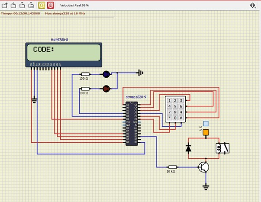

# Description of 4x3 keyboard control
## Team members

Enol Ayo Sando and Marina Balbín Salas

[Proyect Link](https://github.com/EnolAyo/Digital_Electronics_2/tree/master/Labs/08-project/project/project)

## Project objectives
The aim of this proyect is to develop an application which opens a door through a 4x3 keyboard. A 4 digit-code will be inserted and will activate the relay that will open the door. The time to insert this code will be limited and there will be 3 different correct codes to achieve this.There will be a green led illuminated while the door is open and a red led illuminated when the wrong code is inserted. Important information about the state of the system will be sent with UART.

## Hardware description


-PIN PC0 TO PC5 ARE USED TO CONTROL THE KEYBOARD (PC0 to PC2 used as outputs/PC3 to PC6 as inputs). The keypad works as a matrix of switches. When one key is pressed its switch is closed, and therefore corresponding row pin and column key are connected. 

-PIN PB3 TO THE RELAY (used as output).This pin is connected to a resistor and a transistor that is used as an switch. When the output is one the switch is openned and the relay too. There is also a diode in parallel with the relay to protect it.

-PIN PD2 and PD3 used as outputs to connect the LEDs.These are connected in active high.

-PIN PD4,PD5,PD6 PD7,PB0 and PB1 are used to control the LCD display.It will be used for showing the code and also to show if the code is correct or not. 

## Code description and simulations
### KEYPAD.C
In this library we have define the following functions:
```
I.	uint8_t code_analyzer(uint8_t code[4],uint8_t correct_code1[4],uint8_t correct_code2[4],uint8_t correct_code3[4])
```
Used for figuring out if the inserted code is correct or not. The inputs of this function are the code introduced by the user and the 3 correct codes. The output is '1' if the code matches with a correct code and '0' if not.
For this, we declare 3 counters (one for each code). We compare each position of the codes and if they are equal the counter is increased. If the value of counters is 4 it means that the code is correct. If the counter is different from 4, that would mean that the code is incorrect.

```
II	char read_digits(void)
```
Used for scanning the keypad and relating each key to it’s decimal number .

The process to scan a keyboard matrix 4x3 is the next:

4 pins are defined as inputs, in our case PC6–PC3, and they correspond to the rows of the keypad. The other 3 pins operate as outputs from microcontroller, in our case PC2-PC0, and they are connected to the column pins in the keypad. When the function is called, we write in the output pins this sequence:
				011 - 101  - 110 
The input pins are checked after each output value. 
Is known that one key has been pressed if any input bit is equal to zero. Knowing the position of the '0' in the output and the input we get the switch location.
For example, we define 


        GPIO_write_low(&PORTC,0);
	GPIO_write_high(&PORTC,1);
	GPIO_write_high(&PORTC,2);


It would be the 011 output, and then we decode looking the binary combinations, for example:

```
if(GPIO_read(&PINC,3)==0){
		_delay_ms(10);
		while(GPIO_read(&PINC,3)==0);
		return '1';

```

The key keyboard which corresponds to 1 is pressed, because we have a 0 at the input at the position [1,1]

### LECTURE LIBRARIES

We use several libraries used in class:
o	gpio.c -To define the inputs and the outputs of the microcontroller
o	uart.c – To send information about the state of the system though the uart port
o	lcd.c- To show the digits thought the screen.
o	timer.c – To control the times, such as the limit time to introduce the code or opening/closing time of the door.

### MAIN.C

-Set of the input/outputs of the microcontroller. We use PORTC for the keyboard and PORTB for the relay
PONGO AQUI TODO EL CODIGO??
-Timer 1 set with a 33 ms overflow (auqi me falta algo,preguntar a enol) (as used in Laboratories class)
-Definition of the valid codes (3 in our case)

-ISR(TIMER1_OVF_vect)- INTERRUPTION N1
In this interruption ,the introduced code is readed with the function 


```read_digits(&PINC).```

Firstly, we have a control character (control='X'). In the moment that character is different from X we will star to read the code.

```
static uint8_t cnt=0;
	static uint8_t time_limit_on=0;
	static uint16_t time_limit=0;
	char code[4];
	char readed=read_digits(&PINC);
	if(readed!='X'){
		code[cnt]=readed;
		lcd_gotoxy(cnt+1,0);
		lcd_putc(readed);
		cnt++;
		
		if(cnt==1){
			time_limit=0;
			time_limit_on=1;
		}
		if(cnt==4){
			time_limit_on=0;
		}
	}
	
	if(cnt==4){ 
		cnt=0;
	}

```

In the moment that a digit is read, time limit will star to increase. It starts and is switch on also(time_limit=0  time_limit_on=1). We defined a time limit of 250 cycles of 32 ms and we add 1 to time_limit variable. When we archive this condition and also we have the time_limit on,we will reboot our time_limit variable to 0 again because time is over.


```
time_limit++;
	if((time_limit==250)&&(time_limit_on==1)){
		time_limit=0;
		cnt=0;
		lcd_gotoxy(1,0);
		lcd_puts("    ");
	}
    
```
In the moment that we have the 4 digits of our code in the suitable time, the limit time will be switch off. (time_limit_on=0)

### SECOND INTERRUPTION
0,0016sx3s=188cycles
We want the door to be open 3 seconds. The maximum value of the timer is 16ms so to get our goal we need to multiplie and we will get 188 cycles.
We use TIMER 0

## Video/Animation
Write your text here.

## References
1-Class lectures such as the PP’lecture and notes.

2-https://aticleworld.com/matrix-keypad-interfacing-with-pic-microcontroller/

3- http://simulide.blogspot.com/p/blog-page_15.html

4-https://electrosome.com/interfacing-relay-with-pic-microcontroller/#:~:text=A%20relay%20can%20be%20easily,current%20flows%20through%20the%20relay.
